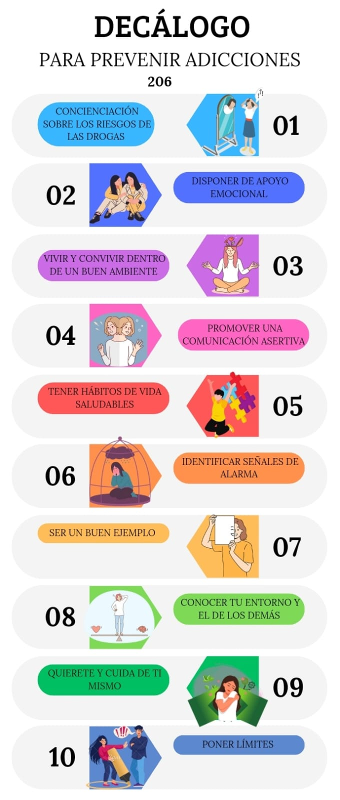
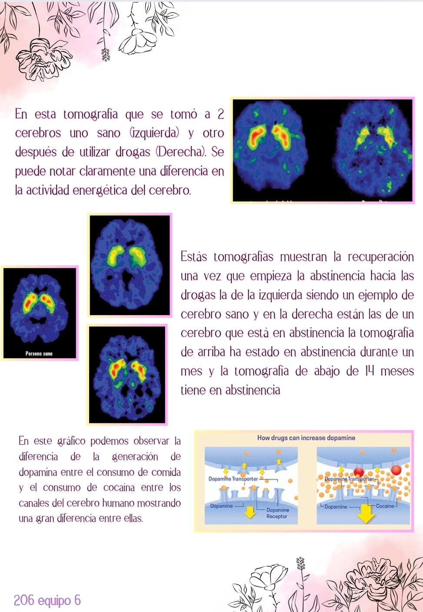

<!DOCTYPE html>
<html lang="es">
<head>

    <meta charset="UTF-8">
    <meta name="viewport" content="width=device-width, initial-scale=1.0">
    <title>Yo elijo una vida sin drogas ¿y tú?</title>

</head>
<body>

    <audio controls loop autoplay>
        <source src="1.mp3" type="audio/mpeg" >
       </audio>

    <h1 class="title">Yo elijo una vida sin drogas ¿y tú?</h1>

     
    
</img>
    
    <h2>Equipo número 6</h2>
    <ul>
        <li>Omar Bautista Rojas</li>
        <li>Danna Karen Bravo Sánchez</li>
        <li>Alan David Vazquez Nieves</li>
        <li>Ariel Yael García Bolaños</li>
        <li>Cristal Guadalupe García García</li>
        <li>Mariana Emily De la Cruz Pérez</li>
        <li>Claudia Sinai Medel Morales</li>
    </ul>
    
    <h3>Materias y Profesores</h3>
    <ol>
        <li>Cultura Digital - LIC. Karina Aviles Portillo</li>
        <li>Humanidades - LIC. Adriana Fabiola Peña Nájera</li>
        <li>Ciencias Sociales - LIC. Gloria Bautista Ramos</li>
        <li>Lengua y Comunicación - LIC. Yadira Lagunes Barradas</li>
        <li>Conservación de la energía y sus interacciones con la materia - ING. Maria Antonia Enriquez Lucio</li>
        <li>Taller De Ciencias - ING. Maria Del carmen Gallegos Rios</li>
        <li>Pensamiento Matematico - ING. Olivia Edith Avendaño Hernandez</li>
 </ol>

<h2>1.-Humanidades</h2>
<h3>En el decálogo ético que realizamos hablamos de como prevenir las drogas a temprana edad
todo esto por medio de la convivencia empatía,  la imposición de límites y la apreciación de uno mismo dando 10 recomendaciones para lograrlo.</h3>
 
    
</img>

<h2>2.-Ciencias Sociales </h2>
<h3>En el proyecto de ciencias sociales se hizo un cuestionario donde explicamos que son las drogas, como afectan a nuestra salud, a nuestra vida familiar y social ya que está se puede volver una adicción muy peligrosa.</h3>
 
    
</img>

    
</img>

    
</img>

<h2>3.-Lengua Y Comunicacion </h2>
<h3>En el proyecto de Lengua Y Comunicacion se hizo una reseña en base a una pelicula que hablara sobre las drogas esto a manera de prevenir a los jóvenes sobre el consumo de sustancias dañinas tanto para la salud como para la vida social y familiar.</h3>
 
    
</img>

<h2>4.Conservacion </h2>
<h3>En el proyecto de conservación se ponen en comparación dos cerebros diferentes uno antes de consumir drogas y otro después en ambos se puede apreciar el cambio respecto a la abstinencia y la liberación de dopamina.</h3>
 
    
</img>

<h2>5.Taller De Ciencias </h2>
<h3>En el proyecto que realizamos para la UAC Taller De Ciencias tuvimos que implementar un prototipo que ayudara a reducir y reemplazar el uso de los plasticos para eso propusimos un tipo de bioplastico que se degrada facilmente.

(La presentacion del prototipo esta en el video, en el link se encuentra la presentacion completa con videos de la exposicion realizada en la feria de ciencias)</h3>
<video controls autoplay> <source src="video 1.mp4"  width="500" height="600" 
border=5px #fBBCA9; >

</video>

<a href="https://www.canva.com/design/DAGIoEMMvuQ/P9addEf22faAjLz5ZVgscA/watch?utm_content=DAGIoEMMvuQ&utm_campaign=designshare&utm_medium=link&utm_source=editor"> 
CLICK PARA LA PRESENTACION COMPLETA </a>

<h2>6-Pensamiento Matematico</h2>
<h3>En el proyecto de la UAC Pensamiento Matematico realizamos una tabla comparativa de instituciones que ayudaran a los jovenes inmiscuidos en las drogas sacando obteniendo estadisticos.</h3>
 
    
</img>

    
    
</body>
</html>
